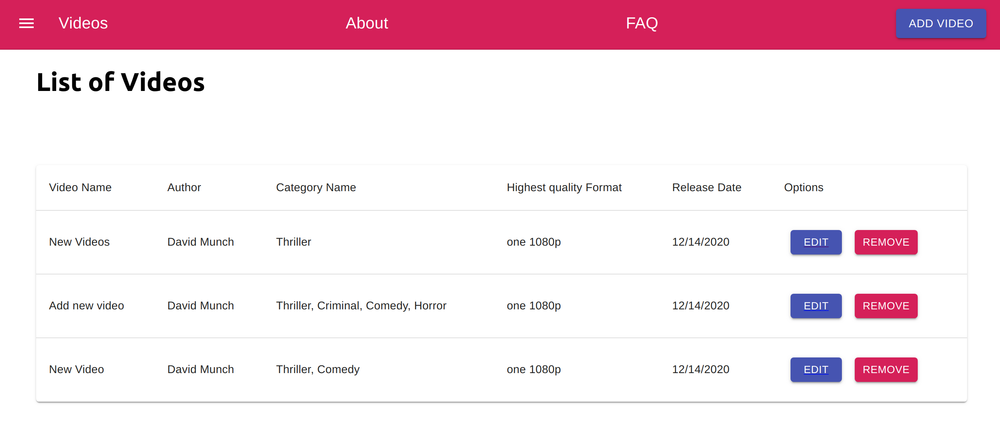
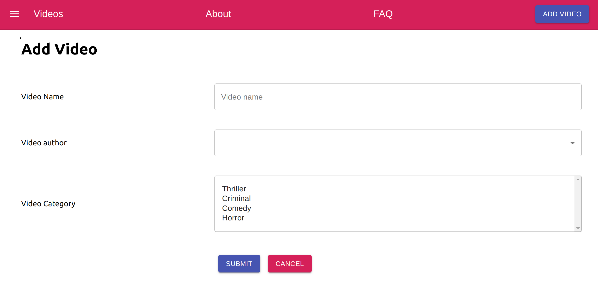

# Movingimage24-videos

## Screenshot

## Prerequisites

[npm](https://www.npmjs.com/get-npm) or [yarn](https://yarnpkg.com/en/docs/install) installed

## Getting Started

1. Clone the repository
   `git clone git@github.com:AlaeddineMessadi/movingimage24-videos.git`

2. Run `yarn` or `npm install`

## Run the project locally

1. run `yarn dev`

## Testing

Run `yarn test`

### Notes

- The backend can be accessed via http://localhost:3001
- It runs with a package called **_json-server_**, and the data comes from the **_db.json_** file
- The JSON structure of the **_db.json_** file was twisted a bit on purpose. Please do not change the original DB structure. Of course, on the front-end side you are free to transform and manipulate the data in any way you feel appropriate
- Material-UI was added to the starter template. If you feel more comforable with another UI framework, you can change it. You can add all the styles that you need

> #### TODO
>
> - more tests.
> - Style enhancements.

## Built With

- [Reactjs](https://reactjs.org/) - JavaScript library for building user interfaces
- [Redux](https://redux.js.org/) - State Management
- [Redux-thunk](https://github.com/reduxjs/redux-thunk) - Thunk middleware for Redux
- [Material-UI](https://material-ui.com/) - React UI framework
- [Jest](https://jestjs.io/) - Testing Framework
- [Yarn](https://yarnpkg.com/) - Dependency Management
- [Create-React-App](https://reactjs.org/docs/create-a-new-react-app.html) - Boilerplate

## License

